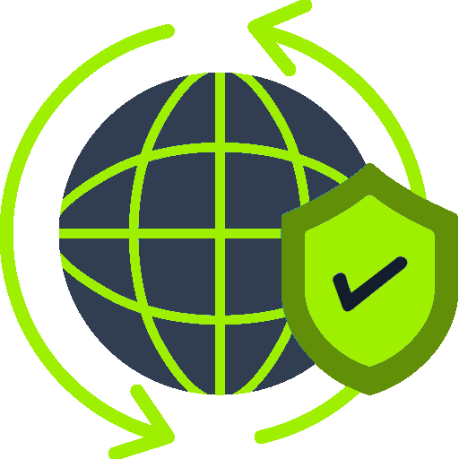
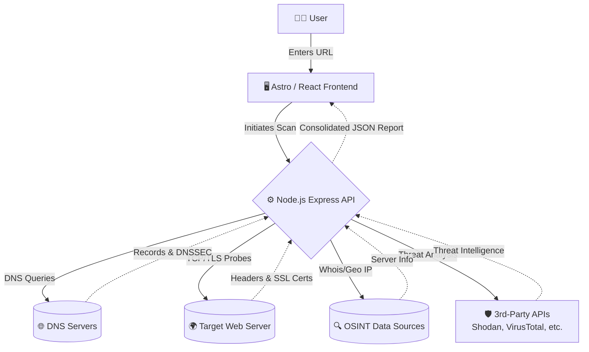

<div align="center">
  
  <h1>SiteScan</h1>
  <p><strong>A powerful all-in-one tool for discovering information about a website and host.</strong></p>
  
  [](https://www.gnu.org/licenses/gpl-3.0)
  [](https://astro.build)
  [](https://nodejs.org/)
  <br><br>
</div>

## 🚀 Overview

SiteScan is a comprehensive, open-source web application designed to help developers, security researchers, and system administrators quickly gather, analyze, and present open data about any given URL.

Simply feed SiteScan a URL, and it will instantly run over 20 concurrent checks to analyze the target's configuration, security posture, and infrastructure.

## 🕵️‍♂️ Available Checks

SiteScan performs a wide array of non-intrusive OSINT and configuration checks, including:

- **Server Info**: IP address, Hosting Provider, ASN, and geographic location.
- **DNS Records**: A, AAAA, MX, TXT, NS, CNAME, SOA, and PTR records.
- **DNSSEC**: Validates if the domain is protected by DNS Security Extensions.
- **SSL/TLS Certificates**: Issuer details, expiration dates, and cipher suites.
- **HTTP Security Headers**: Analysis of HSTS, CSP, X-Frame-Options, and more.
- **Mail Security**: Verification of SPF, DKIM, and DMARC records to prevent spoofing.
- **Open Ports**: Quick scans of common web and infrastructure ports (80, 443, 21, 22, etc.).
- **Firewall/WAF Detection**: Detects if the site is behind Cloudflare, AWS WAF, Sucuri, etc.
- **Threat Intelligence**: Cross-references the domain and IP against public blocklists and threat feeds.
- **Robots.txt & Sitemap**: Extracts crawling rules and sitemap locations.
- **Security.txt**: Checks for the presence of a responsible disclosure policy.
- **Cookies**: Analyzes cookie flags (Secure, HttpOnly, SameSite) for vulnerabilities.
- **Redirects**: Follows and maps out the complete HTTP redirect chain.

## ✨ Features

- **Blazing Fast**: Powered by an Astro frontend and a Node.js API backend.
- **Premium Light Theme**: An aesthetically pleasing, responsive, and dynamic user interface.
- **Non-Technical Summaries**: Highly technical outputs are automatically simplified and summarized into easily actionable insights.
- **Micro-Animations & Interaction**: A dynamic and engaging design out-of-the-box.
- **No Database Required**: Fully stateless and easy to deploy.

## 🛠️ Tech Stack

- **Frontend**: [Astro](https://astro.build/), [React](https://react.dev/), [Svelte](https://svelte.dev/)
- **Styling**: SCSS, Emotion, Custom CSS Variables
- **Backend**: [Node.js](https://nodejs.org/), Express
- **Build**: Vite, ESBuild

## 🏗️ Architecture



## 🚀 Getting Started

### Prerequisites
Make sure you have Node.js (v18+) and npm/yarn installed.

### Installation

1. **Clone the repository**
   ```bash
   git clone https://github.com/Subhan-Haider/site-scan.git
   cd site-scan
   ```

2. **Install dependencies**
   ```bash
   npm install
   ```

3. **Run the development server**
   ```bash
   npm run dev
   ```
   This will start both the backend API (port 3001) and the Astro frontend (port 4321) concurrently.

4. **Visit the app**
   Open `http://localhost:4321` in your browser.

## ⚙️ Configuration

SiteScan works completely out of the box. However, you can configure custom API keys for third-party services to enhance the checks. 
Rename `.env.sample` to `.env` and add your keys!

## 🤝 Sponsors & Projects

This project is maintained by **Subhan Haider**. Check out some of my other projects and sponsors:
- [Humanize AI](https://subhan.tech) - Bypass AI detectors with our state-of-the-art text humanization engine.
- [Image Converter Pro](https://www.lootops.website) - Studio-grade image conversion. Batch process entirely in your browser.
- [CodeLens](https://codelens.site)
- [BlizFlow](https://blizflow.online)
- [AdShield VPN](https://adshield-vpn.subhan.tech)
- [Emoji Smuggle](https://emoji.subhan.tech)
- [Pixel Pong](https://pong.subhan.tech)
- [Stealth Vault](https://security.subhan.tech)
- [LootOps](https://lootops.me)
- [Media Server](https://media.subhan.tech)

## 🐳 Deployment

You can deploy SiteScan easily via Docker!
```bash
docker build -t sitescan .
docker run -p 4321:4321 -p 3001:3001 sitescan
```
*Note: Make sure to pass your `.env` variables into the Docker container for API keys to work.*

## 🤝 Contributing

Contributions are what make the open source community such an amazing place to learn, inspire, and create. Any contributions you make are **greatly appreciated**.

1. Fork the Project
2. Create your Feature Branch (`git checkout -b feature/AmazingFeature`)
3. Commit your Changes (`git commit -m 'Add some AmazingFeature'`)
4. Push to the Branch (`git push origin feature/AmazingFeature`)
5. Open a Pull Request

## 📜 License

This project is open-source and available under the [GNU General Public License v3.0 (GPLv3)](LICENSE).
